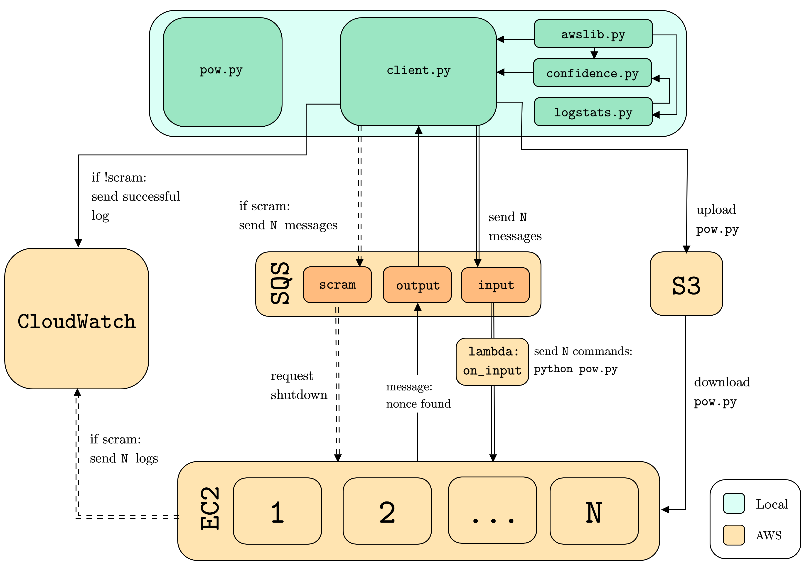

# cloud-nonce-discoverer

This repository contains code for the implementation of a 'Cloud Nonce Discoverer' (CND), which resembles a [Proof-of-Work](
) system, extracting the *["golden nonce"](https://en.bitcoin.it/wiki/Nonce)* for an arbitrary block of data. This method is commonly used as a consensus protocol by blockchain networks in order to verify incoming blocks.

With the search space to find the golden nonce being a number between 0 and , an increasing difficulty leads to an exponential runtime of ). As such, the aim of this system is to utilise AWS cloud infrastructure, in order to parallelise the brute force search across multiple virtual machines to gain superior performance compared to one of local design. 

Further details of the implementation and its results can be found in the accompanying [report](./report/report.pdf). This was implemented as part of the coursework for the Cloud Computing unit at the University of Bristol.

## Architecture

<p align="center">
    
</p>

AWS technologies used:

- S3
- SQS
- EC2
- Lambda
- CloudWatch Logging

## Deployment

### Prerequisites

- An AWS account
- `Python 3.7+`
- `boto3`
- `awscli`
- `jsonmerge`

### Setup

1. Create a user at https://console.aws.amazon.com/iam/home?region=us-west-1#/users with AdministratorAccess
    - Enter your credentials in `~/.aws/credentials`
2. Create roles at https://console.aws.amazon.com/iam/home?region=us-west-1#/roles for the following:
    - AmazonEC2FullAccess
    - AmazonEC2RoleforSSM
    - AWSLambdaFullAccess
    - AmazonSSMFullAccess
    - AWSLambdaSQSQueueExecutionRole
    - CloudwatchApplicationInsightsServiceLinkedRolePolicy
3. Create an S3 bucket
4. Create 3 SQS queues named: 'in_queue', 'out_queue', 'scram_queue'
5. Create a Lambda function using the code in [on_input.py](./lambda/run_script.py)
    - Map the queue 'in_queue' to this Lambda function
6. Run `python client.py -i {number of instances} -d {difficulty} -t {timeout}`

### Deployment

To run using direct specification of number of instances:

```python
python client.py -i {number of instances} -d {difficulty} -t {timeout}
```

To run using indirect specification determining the number of instances from the runtime provided:

```python
python client.py -i {number of instances} -d {difficulty} -c
>>> Enter your confidence value: 0.95
>>> Enter your desired runtime: 4.5
>>> Would you like to use the minimum number of instances possible? y/n : n
```

Note: The effectiveness of indirect specfication will vary depending on how many times the program has been previously run, as it makes use of historical log data in order to make a well-informed decision.

### Arguments

- `instances -i`  : The number of EC2 instances to divide the task across.
- `difficulty -d` : The difficulty of nonce discovery. This corresponds to the number of leading zero bits required in the hash.
- `timeout -t`    : Limit of time in seconds before scram is initiated.
- `logscram -l`   : Gives the option to collect logs from instances on the event of a scram.
- `confidence -c` : This will allow the program to automatically choose the number of instances to spawn according to runtime.
